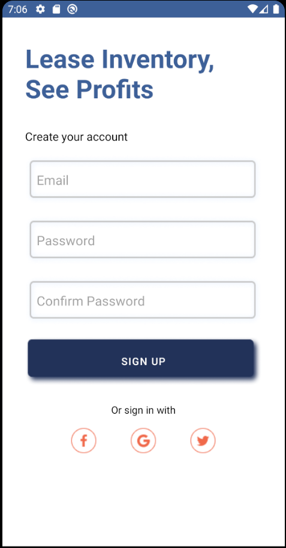

Our project is called Lease Inventory, See Profits (LISP) and it is a local rental marketplace. Users can post items to rent or rent items from others.

You can run this Android app through Android Studio.

Screenshots:

Sign up

Sign in

Home

Post rental

Rent item

Video Demo in the root directtory!
